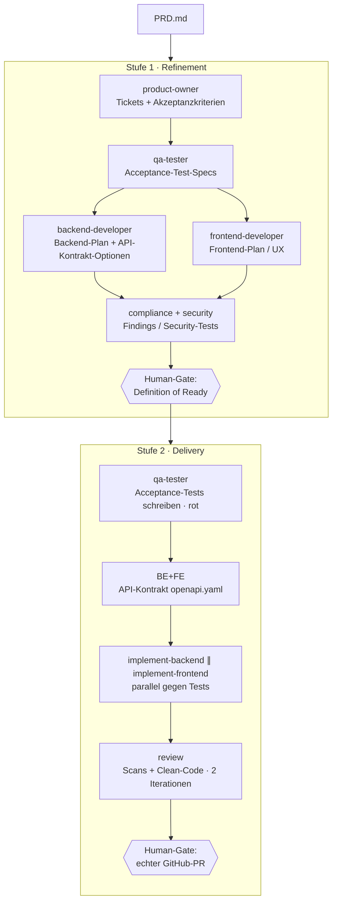

# Das agentische Setup

Dieses Repo demonstriert ein **agentisches Delivery-Setup** in Claude Code: Aus einem PRD entstehen über spezialisierte Agenten reife Tickets und schließlich echte Implementierung — mit **bewussten Human-Gates** an den Stellen, an denen ein Mensch entscheiden muss.

Die Agenten und Skills liegen im Repo unter `.claude/` und „reisen" so mit: Wer das Repo in Claude Code öffnet, hat dasselbe Setup.

## Zwei Stufen

## Rollen (Agenten in `.claude/agents/`)

| Agent | Rolle | Ergebnis |
|---|---|---|
| `product-owner` | Schneidet Roadmap-Items in Tickets, formuliert testbare Akzeptanzkriterien (AC) | Tickets + AC (der „Vertrag") |
| `qa-tester` | Leitet aus AC ausführbare Acceptance-Tests ab, deckt Edge-/Error-Fälle auf | Given/When/Then-Specs, später rote Tests |
| `backend-developer` | Datenmodell, API-Kontrakt, Tech-Approach-**Optionen** | Backend-Plan |
| `frontend-developer` | UI/UX-Flows, Screens/States, kürzeste Wege | Frontend-Plan |
| `compliance` | DSGVO-/Rechts-Prüfung (personenbezogene Daten, Löschung, Einwilligung …) | Findings, die DoR/DoD blocken |
| `security` | Bedrohungsbetrachtung → konkrete Security-Tests | Security-Anforderungen/-Tests |
| `refinement-orchestrator` | Routet Stufe 1, hält die Human-Gates | reife Tickets (DoR) |
| `delivery-orchestrator` | Routet Stufe 2 bis zum fertigen MR | echter GitHub-PR |

Die zugehörigen **Skills** (`.claude/skills/`) tragen die Methodik: `define-tickets`, `define-acceptance-tests`, `define-backend-plan`, `define-frontend-plan`, `check-compliance`, `define-security-tests` (Refinement) sowie `write-acceptance-tests`, `implement-backend`, `implement-frontend`, `run-scans` (Delivery).

## Leitprinzipien

- **Human-Gates statt Vollautonomie.** Der Mensch entscheidet an definierten Punkten: Ticket-Freigabe (DoR), Tech-Approach-Wahl, fertiger MR. Die Agenten legen *Optionen* vor, treffen aber keine Produkt- oder Architektur-Grundsatzentscheidung allein.
- **Test-First.** QA schreibt die Acceptance-Tests, *bevor* implementiert wird. Sie sind der Vertrag, gegen den BE und FE parallel bauen.
- **Extraktiv, nicht erfindend.** Fehlt fachliche Information (z. B. „Was passiert bei gleicher ISIN?"), wird eskaliert statt geraten — siehe die offenen Punkte in `refinement/01-tickets.md`.

## Geteilte Regeln (Team-Constitution) — Prototyp

Die *cross-cutting* Regeln (Scope-Disziplin, AC = Vertrag, „nicht erfinden → Bounce", Human-Gates, Ehrlichkeit, Refinement ≠ Delivery, Delivery-Standards) waren zuvor in jeder Rolle neu formuliert — dieselbe Verfassung 5–9× dupliziert. Sie sind jetzt **einmal** in [`CLAUDE.md`](../CLAUDE.md) extrahiert (Single Source of Truth, wird von Claude Code auto-geladen).

- **Ausgedünnt (Beispiel):** `backend-developer`, `qa-tester` — Cross-Cutting → Verweis + Ein-Zeilen-Kurzfassung, **Rollenspezifisches bleibt inline**.
- **Unverändert (zum Vergleich):** die übrigen sechs Agenten — bewusst als Vorher/Nachher belassen.
- **Vor Rollout aufs globale `~/.claude` verifizieren:** ob **Subagenten** die `CLAUDE.md` erben. Falls nicht, kritische Gate-/Eskalations-Regeln bei den Orchestratoren inline halten (deshalb behält jeder ausgedünnte Agent eine inline-Kurzfassung).
- **Nutzen vs. Preis:** Wartbarkeit (eine Stelle statt neun) gegen Indirektion. Für die *Verfassung* lohnt es sich, für *Leaf-Regeln* nicht.

## Was für den Workshop schon erledigt ist

Damit die gemeinsame Zeit auf dem Interessanten liegt (Live-Implementierung + technische Bewertung), ist **Stufe 1 (Refinement) für US1–US3 vorbereitet** — siehe `docs/refinement/`. Im Workshop steigen wir bei **Stufe 2 (Delivery)** ein und/oder nehmen eine **Ausbaustufe** aus dem PRD als Live-Erweiterung.
